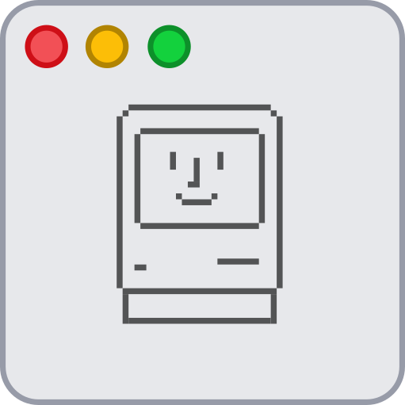
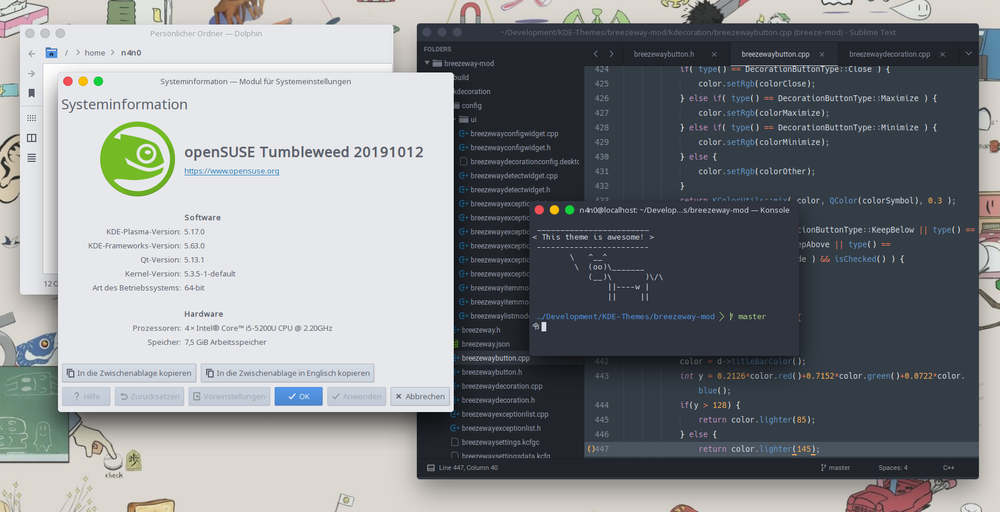
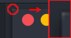
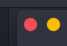
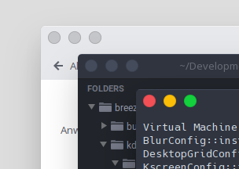
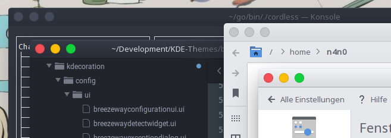
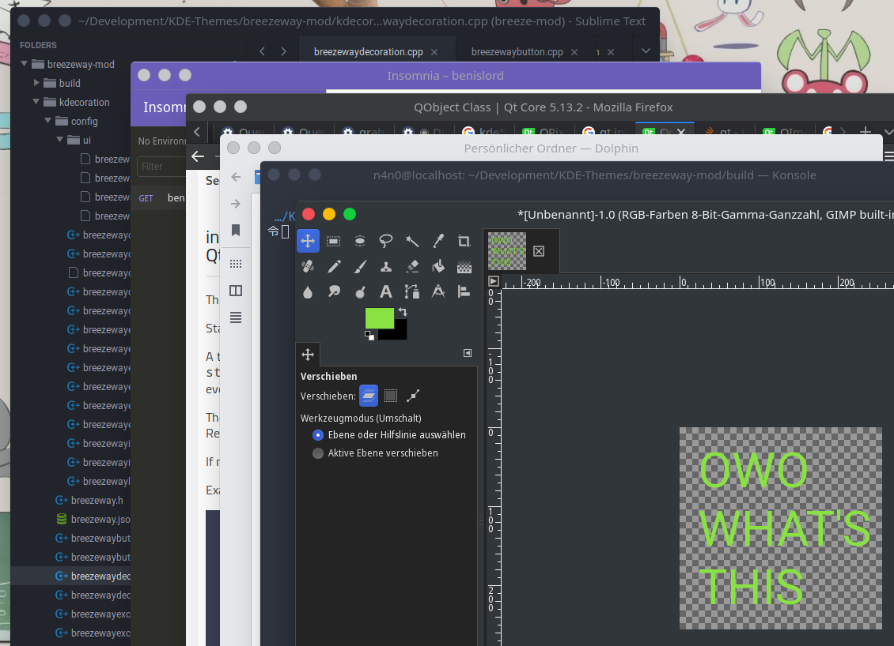

# BreezewayMod
## About
 

BreezewayMod is a fork of the Breezeway window decoration which aims to mimic the macOS interface. But with powerups.
Did I mention that it comes without weird glitches on the rounded corners?

## Screenshots


Looks good with light and dark color schemes (shown here with color schemes "Arc" for light windows and "Arc-Dark" for dark windows)



The usual glitch on dark themes.



Glitch-b-gone with Breezeway magick!



If overlapping windows have not enough contrast between each other it's sometimes hard to see overlapping titlebars of you use a flat theme. Luckily, BreezewayMod comes with a neat highlight line across the top of your titlebar to get that sorted out!



If you wish to have subtle gradients with a nicely drawn separator for your titlebar, you can have just that. The gradient and separator will, like all nifty color features, use the title bar color to determine their values. How cool is that?

## Experimental Features


With the power of Halloween and the dark arts combined, we can now match the titlebar color to the window color. And I don't mean some lame shit where I make use of ```QPalette::Window``` in the hopes of getting a nice looking window color, mmh no no no! This feature is still in early beta though and color glitches _will_ occur. Uncheck "Match colors" in the settings to turn the feature off.

## Build & Install
Clone the repository to a directory of your choice:
```
git clone https://github.com/n4n0GH/breezeway-mod
```
Note: it is recommended to clone it somewhere where you can leave the built directory in case you want to uninstall the theme. If you accidentally deleted the directory, check below for how to uninstall manually.

Next create a subfolder called build, change directory to that subfolder, run `cmake` in that subfolder, `make` and `make install`:
```
mkdir build && cd build
cmake -DCMAKE_INSTALL_PREFIX=/usr ..
make
sudo make install
```

## Uninstall
In the build directory use the following command to remove the theme:
```
sudo make uninstall
```

If you don't have this directory anymore, you need to manually delete the following files and folders:
```
/usr/lib64/cmake/BreezewayMod/BreezewayConfig.cmake
/usr/lib64/cmake/BreezewayMod/BreezewayConfigVersion.cmake
/usr/lib64/qt/plugins/org.kde.kdecoration2/breezewaydecoration.so
/usr/share/kservices5/breezewaydecorationconfig.desktop
/usr/lib64/libbreezewaycommon5.so.5.16.5
/usr/lib64/libbreezewaycommon5.so.5
```

## FAQ
> What's the biggest differences between this and Breezeway?

As of now there are so many changes that it's fair to say it's a completely different theme.
