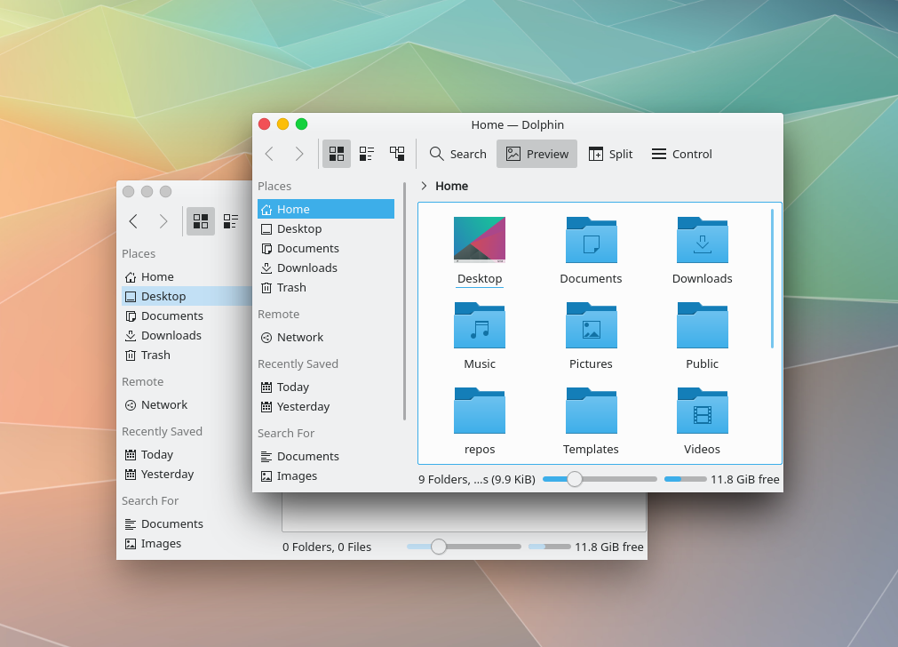
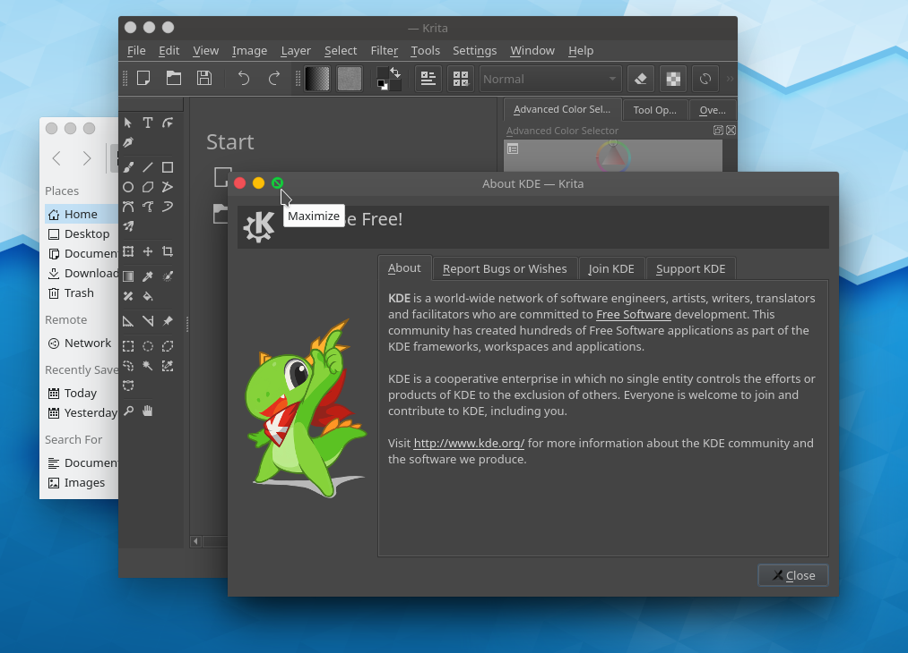

# Breezeway
## About
Breezeway is a Breeze window decoration fork that mimics macOS style.  
Not many features at this moment.

## Build
    sudo apt install cmake extra-cmake-modules libkdecorations2-dev libkf5coreaddons-dev libkf5guiaddons-dev libkf5configwidgets-dev libkf5windowsystem-dev libkf5iconthemes-dev libqt5x11extras5-dev
    mkdir build
    cd build
    cmake -DCMAKE_INSTALL_PREFIX=`kf5-config --prefix` ..
    make
    sudo make install

